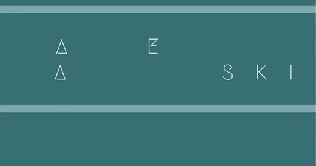

  

I'm fun to work with and I am always open to learning new things from others. I love to code.

💻 I’m currently working on 

💡 I’m currently learning ... 

 You can reach me at: 

[Email Me](kjablonski08@gmail.com)

😄 Pronouns: she/her 

When I am not coding I am usually on a hike with my rescue dog, Dax, or knitting while enjoying a movie

